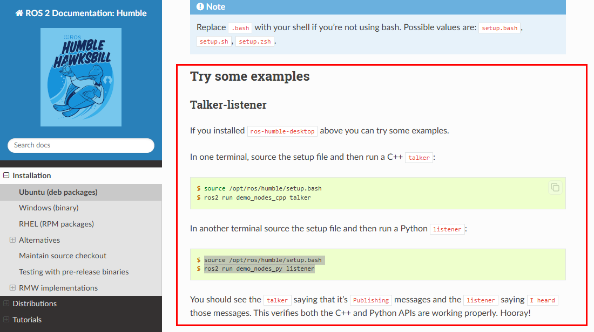
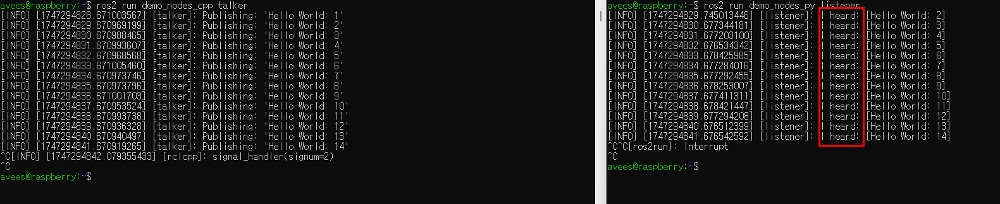
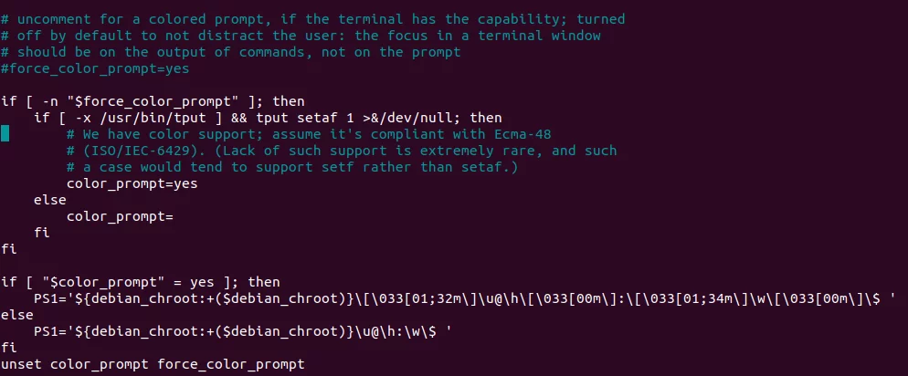

# 2025 SEA:ME Hackathon


During this hackathon, your mission is to develop a autonomous driving system based on PiRacer Pro. We'll provide you a Raspberry Pi 4 board.


***
# Tutorial 4 Hackaton

## Index
- [Hardware Setup](docs/hardware_setup.md)
- [Raspberry Pi OS Setup (Ubuntu 22.04)](docs/raspi-os.md)
- [ROS2-humble Installation](docs/ros2-humble_installation.md)
- [Pi-Racer Setup](docs/piracer_setup.md)
- [Joystick Setup](docs/joystick.md)
- [USB Camera Setup](docs/usb_cam.md)

# RaspBerryPi ~Donkey CAR HW setting

라즈베리파이 핀 맵 번호 → donkey car 배터리 보드 핀 번호

```jsx
2번 -> 5V
4번 -> 5V
6번 -> GND

1번 -> 3V3
3번 -> SDA
5번 -> SCL
```


아래 완성본 참고


- 방열팬 세팅

1. 팬 나사 조립


2. 방열 스티커 부착


3. 방향 맞추어 라즈베리파이에 부착


4. 팬 연장선 (암-수 점퍼선) 사용


5. 라즈베리 파이 핀 사용하여 전원 공급

```jsx
17번(3V3) -> 빨강선
20번(GND) -> 검정선
```

아래 핀 맵 참고


완성 시 사진


사용하지 않음


---

# Raspberry Pi OS 셋팅(Ubuntu 22.04)

## Step1. Window PC에서 Raspberry Pi Imager 실행

(imager 다운 링크 : [Click_here](https://www.raspberrypi.com/software/))


## Step2. 기기선택 ⇒ Raspberry pi4를 선택


## Step3. OS선택

 Other general-purpose OS ⇒ Ubuntu ⇒ Ubuntu DeskTop 22.04(22.04.05도 가능)


## Step4. Window PC에 SD카드를 삽입 후, 해당 위치를 선택


## Step5. 완료 (Writing 완료 후에 SD카드를 Raspberry Pi에 삽입)


---

# ROS2-humble 설치

## Step1. 링크를 타고 들어가서 설치를 진행해주세요.(사진도 참고)

[Ubuntu (deb packages) — ROS 2 Documentation: Humble  documentation](https://docs.ros.org/en/humble/Installation/Ubuntu-Install-Debs.html)

(사진 설명) Try Some examples까지 진행한다.



다음과 같은 화면이 뜨면 설치 성공(사진을 더블클릭하면 글씨가 잘보여요)



## Step2. bash 설정

터미널 창을 새로 열때마다 “source /opt/ros/humble/setup.bash” 해줘야함

자동으로 설정하기

“gedit ~/.bashrc” 명령어를 입력하여 bash 진입



맨 밑에 줄에 “source /opt/ros/humble/setup.bash” 삽입 후 exit

exit 후에 터미널창에 “source ~/.bashrc”입력(변경사항 저장)

---

# Pi-Racer 구동 환경 설정

## Step.1 local setting

```cpp
pip install piracer-py
sudo apt install raspi-config

sudo raspi-config
```

이후 finish 하여 빠져 나올 것

## Step.2 배터리 OLED 활성화

1. 의존성 체크(Tip 한줄씩 붙혀넣기할것)

```jsx

sudo pip3 install luma.oled
sudo pip3 install luma.core
sudo pip3 install Pillow
```

2. i2c 활성화 

```jsx
sudo raspi-config
```

- `3 Interface Options` (또는 `5 Interfacing Options`) 선택
- `P5 I2C` 선택
- `Yes`를 선택하여 I2C 기능을 활성화합니다.
- 재부팅하라는 메시지가 나오면 재부팅합니다.

- 권한문제 발생시(PermissionError: [Errno 13] Permission denied: '/dev/i2c-1’)
    
    2-1. i2c 권한 체크
    
    ```jsx
    ls -l /dev/i2c-1
    ```
    
    만약
    
    ```jsx
    crw-rw---- 1 root **dialout** 89, 1 Feb 20 22:24 /dev/i2c-1
    ```
    
    으로 나온다면 그룹추가 해주어야함
    
    2-2. 사용자 계정을 `dialout` 그룹에 추가
    
    ```jsx
    sudo adduser avees dialout
    sudo reboot
    ```
    
    이후
    
    ```jsx
    python3 oled.pys
    ```
    
3. 사용자 계정을 `i2c` 그룹에 추가

I2C가 활성화되었는지 확인한 후, 현재 로그인된 사용자(여기서는 `avees`)를 `i2c` 그룹에 추가합니다.

이 명령을 실행하면 `avees` 사용자가 `i2c` 그룹에 추가됩니다.

4. oled 코드 작성

```jsx
mkdir oled
cd ~/oled
gedit oled.py
```

아래 코드 복사하여 붙혀넣기

```jsx
import time
from board import SCL, SDA
import busio
from adafruit_ina219 import INA219

from luma.core.interface.serial import i2c
from luma.core.render import canvas
from luma.oled.device import ssd1306, ssd1325, ssd1331, ssd1309
from PIL import ImageFont, ImageDraw, Image

i2c_bus = busio.I2C(SCL, SDA)
ina219 = INA219(i2c_bus)

MAX_VOLTAGE = 16.8

MIN_VOLTAGE = 12.0

def get_battery_percentage(voltage):
    if voltage >= MAX_VOLTAGE:
        return 100
    elif voltage <= MIN_VOLTAGE:
        return 0
    else:

        percentage = ((voltage - MIN_VOLTAGE) / (MAX_VOLTAGE - MIN_VOLTAGE)) * 100
        return round(percentage)

serial = i2c(port=1, address=0x3C) 
device = ssd1306(serial)

try:
    font = ImageFont.truetype("DejaVuSans.ttf", 20) 
except IOError:
    font = ImageFont.load_default() 

try:
    while True:
        voltage = ina219.bus_voltage + ina219.shunt_voltage
        current = ina219.current
        power = ina219.power

        battery_percent = get_battery_percentage(voltage)

        with canvas(device) as draw:
            draw.text((0, 0), f"Volt: {voltage:.2f}V", font=font, fill="white")
            draw.text((0, 32), f"Batt: {battery_percent}%", font=font, fill="white")
            # draw.text((0, 32), f"Curr: {current:.2f}mA", font=font, fill="white")

        print(f"Voltage: {voltage:.2f}V, Current: {current:.2f}mA, Power: {power:.2f}W, Battery: {battery_percent}%")
        time.sleep(1) 

except KeyboardInterrupt:
    with canvas(device) as draw:
        draw.text((0, 0), "Monitoring Off", font=font, fill="white")
    time.sleep(1)
```

5. 재부팅 및 실행

```jsx
sudo reboot
```

이후
```jsx
cd ~/oled
python3 oled.py
```
완료

---
# Set Joystick

```jsx
pip3 install piracer-py
```

```jsx
mkdir remote_control
cd remote_control
```

```jsx
touch joystick_control.py
```

```jsx
nano joystick_control.py
```

아래 코드 입력 

```
from piracer.vehicles import PiRacerPro
from piracer.gamepads import ShanWanGamepad

if __**name__** == '__**main__**':
	
	shanwan_gamepad = ShanWanGamepad()
	piracer = PiRacerPro()
	# piracer = PiRacerStandard()
	
	while True:
	    gamepad_input = shanwan_gamepad.read_data()
	
	    throttle = gamepad_input.analog_stick_right.y * 0.5
	    steering = -gamepad_input.analog_stick_left.x
	
	    print(f'throttle={throttle}, steering={steering}')
	
	    piracer.set_throttle_percent(throttle)
	    piracer.set_steering_percent(steering)

```

조이스틱 실행


---


**🔧 완료 🔧**
