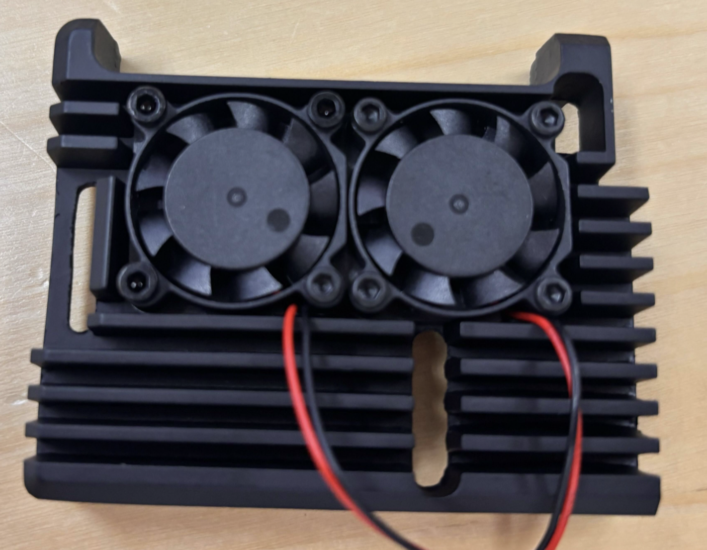
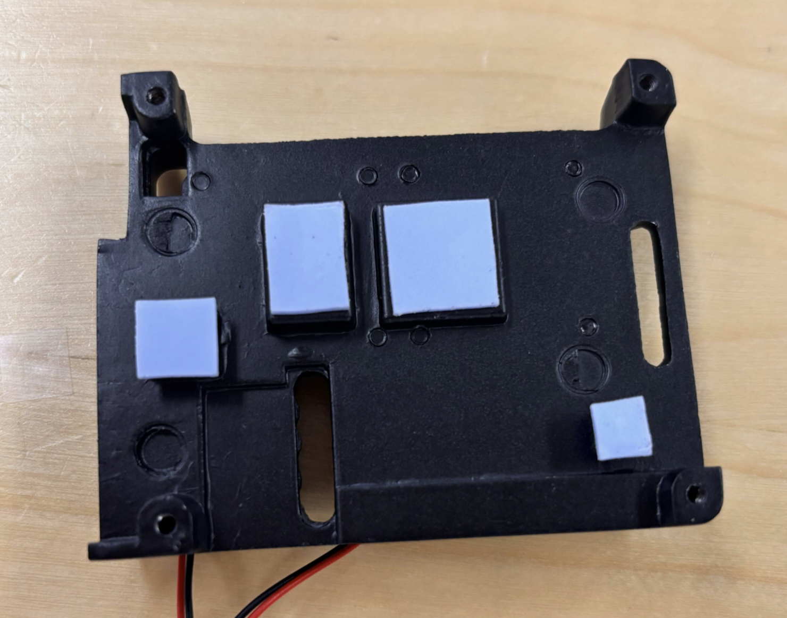
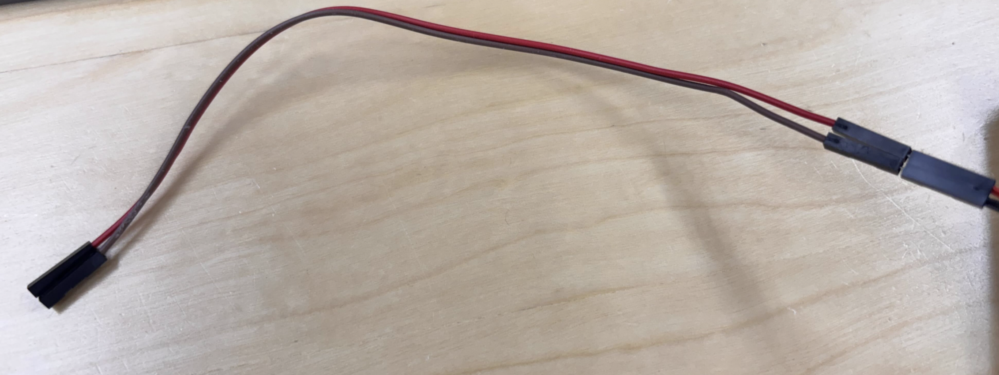
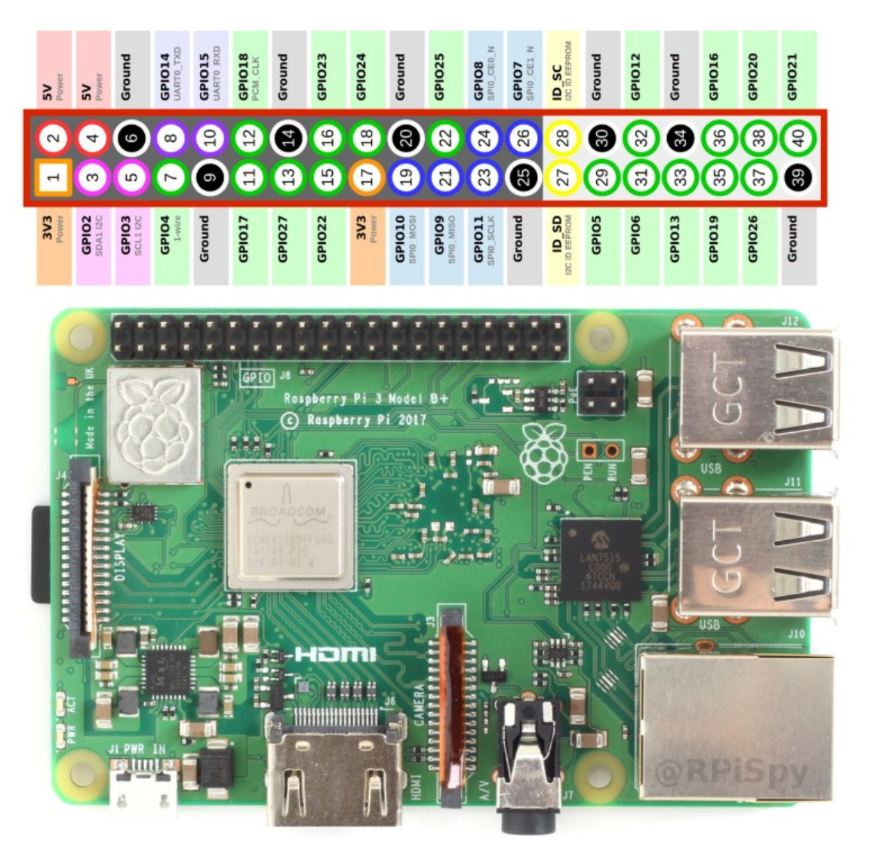
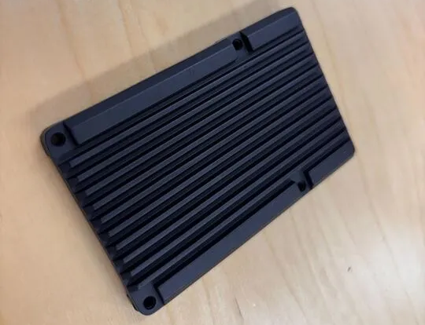
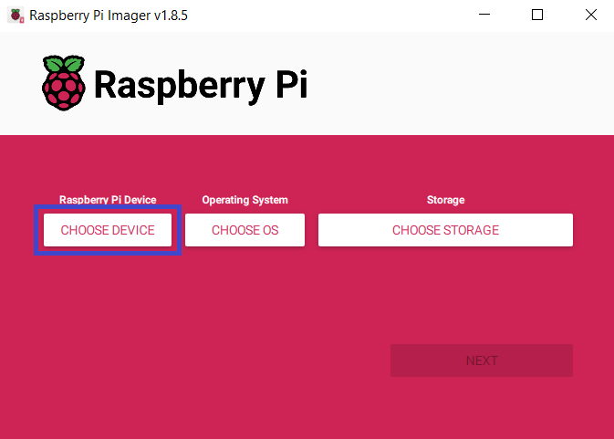
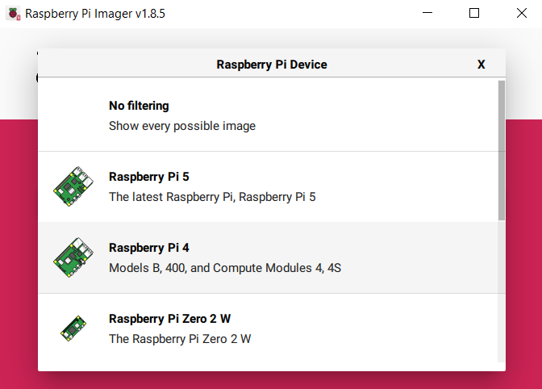
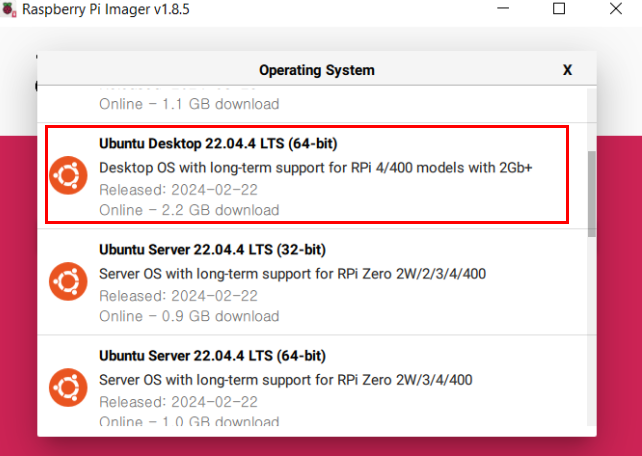
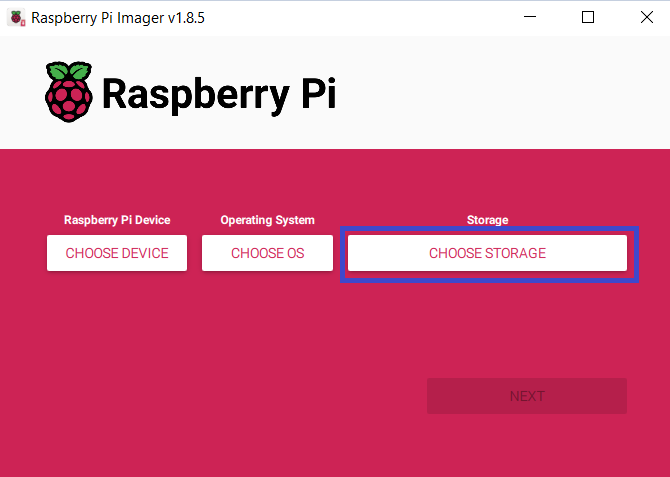
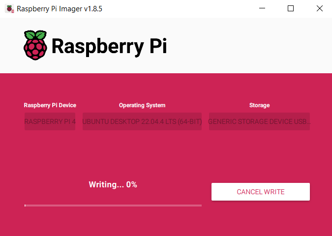

# 2025 SEA:ME Hackathon


During this hackathon, your mission is to develop a autonomous driving system based on PiRacer Pro. We'll provide you a Raspberry Pi 4 board.


***
# Tutorial 4 Hackaton

# 1.RaspBerryPi ~Donkey CAR HW setting

라즈베리파이 핀 맵 번호 → donkey car 배터리 보드 핀 번호

```jsx
2번 -> 5V
4번 -> 5V
6번 -> GND

1번 -> 3V3
3번 -> SDA
5번 -> SCL
```


아래 완성본 참고


- 방열팬 세팅

1. 팬 나사 조립



2. 방열 스티커 부착



3. 방향 맞추어 라즈베리파이에 부착


4. 팬 연장선 (암-수 점퍼선) 사용



5. 라즈베리 파이 핀 사용하여 전원 공급

```jsx
17번(3V3) -> 빨강선
20번(GND) -> 검정선
```

아래 핀 맵 참고



완성 시 사진


사용하지 않음



---

## Raspberry Pi OS 셋팅(Ubuntu 22.04)

## Step1. Window PC에서 Raspberry Pi Imager 실행

(imager 다운 링크 : [Click_here](https://www.raspberrypi.com/software/))


## Step2. 기기선택 ⇒ Raspberry pi4를 선택





## Step3. OS선택

 Other general-purpose OS ⇒ Ubuntu ⇒ Ubuntu DeskTop 22.04(22.04.05도 가능)



## Step4. Window PC에 SD카드를 삽입 후, 해당 위치를 선택



## Step5. 완료 (Writing 완료 후에 SD카드를 Raspberry Pi에 삽입)



