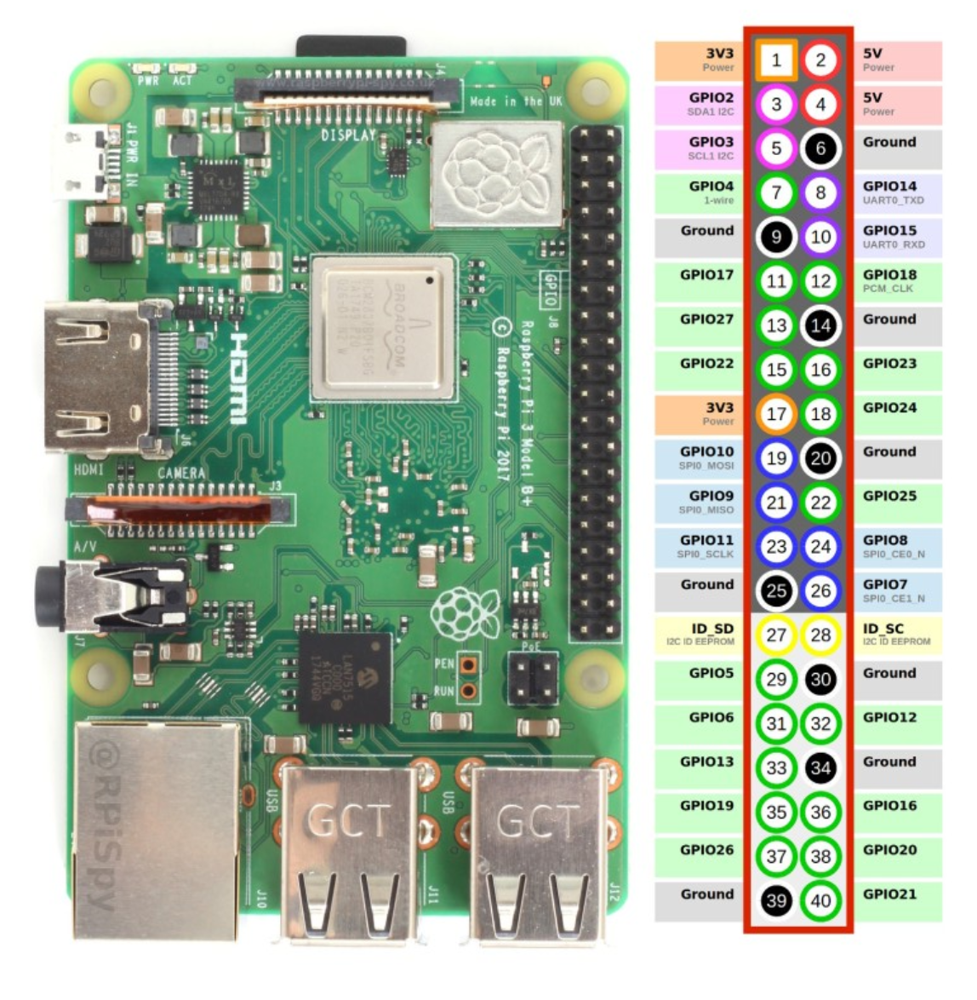

# RaspBerryPi ~Donkey CAR HW setting

라즈베리파이 핀 맵 번호 → donkey car 배터리 보드 핀 번호

```jsx
2번 -> 5V
4번 -> 5V
6번 -> GND

1번 -> 3V3
3번 -> SDA
5번 -> SCL
```

<p align="center">
  
</p>

아래 완성본 참고
<p align="center">
  
</p>

- 방열팬 세팅

1. 팬 나사 조립
<p align="center">
  
</p>


3. 방열 스티커 부착
<p align="center">
  
</p>


5. 방향 맞추어 라즈베리파이에 부착
<p align="center">
  
</p>


7. 팬 연장선 (암-수 점퍼선) 사용

<p align="center">
  
</p>

5. 라즈베리 파이 핀 사용하여 전원 공급
```jsx
17번(3V3) -> 빨강선
20번(GND) -> 검정선
```

아래 핀 맵 참고
<p align="center">
  
</p>


완성 시 사진

<p align="center">
  
</p>


사용하지 않음

<p align="center">
  
</p>

