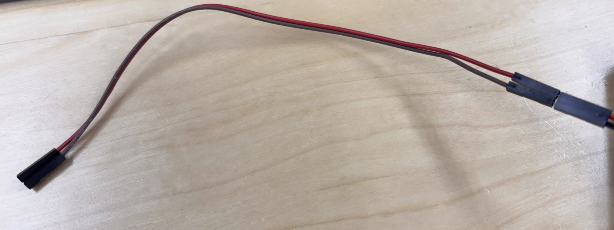

# Donkey Car & RaspBerry Pi HW Setup

## Step 1. Donkey Car 조립
```
아래 PDF 파일을 참고하여, Donkey Car를 조립한다.
```

[Piracer_pro_ai_kit-en2.pdf](https://github.com/user-attachments/files/20992632/Piracer_pro_ai_kit-en2.pdf)


## Step 2. Donkey Car, Raspberry Pi 연결
```
아래 핀 맵 정보를 참고하여 Donkey Car와 Rasberry Pi를 연결한다.
(핀을 잘못 연결할 경우 보드 고장의 원인이 될 수 있으니 주의.)
```

```
1번 -> 3V3 | 2번 -> 5V
3번 -> SDA | 4번 -> 5V
5번 -> SCL | 6번 -> GND
```

<p align="left">
  
</p>

> 참고 사진
<p align="left">
  
</p>


## Step 3. 방열판 세팅
### 1. 팬 나사를 조립
<p align="left">
  
</p>

### 2. 방열 스티커 부착
<p align="left">
  
</p>

### 3. Raspberry Pi에 부착
<p align="left">
  
</p>


### 5. Raspberry Pi 핀 사용하여 전원 공급
```
17번(3V3) -> 빨강선
20번(GND) -> 검정선
```
```
아래 핀 맵 참고
```
<p align="left">
  
</p>

```
케이블이 짧을 경우 팬 연장선 (암-수 점퍼선) 사용
```
<p align="left">
  
</p>

> 완성 시 사진
<p align="left">
  
</p>

```
아래 부품은 사용하지 않음
```
<p align="left">
  
</p>

