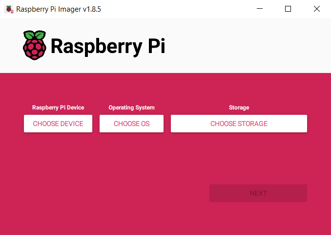
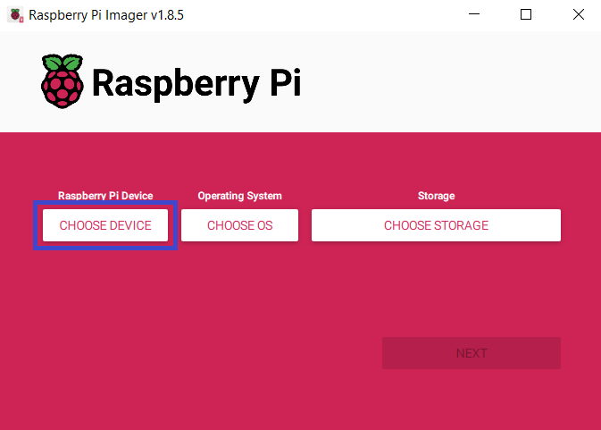
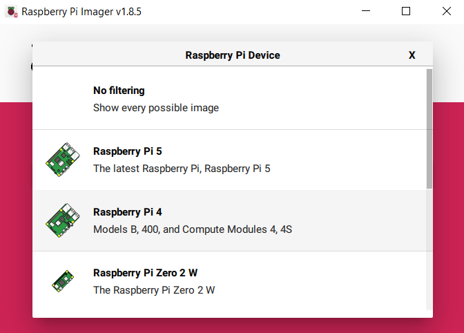
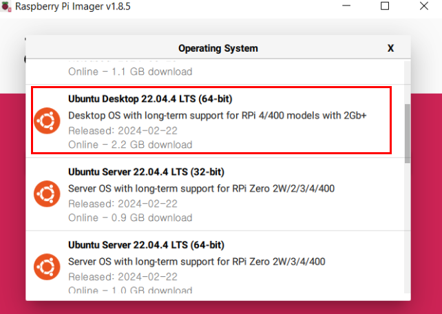
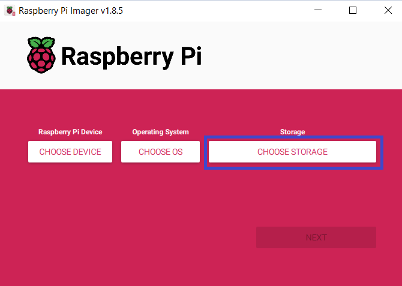
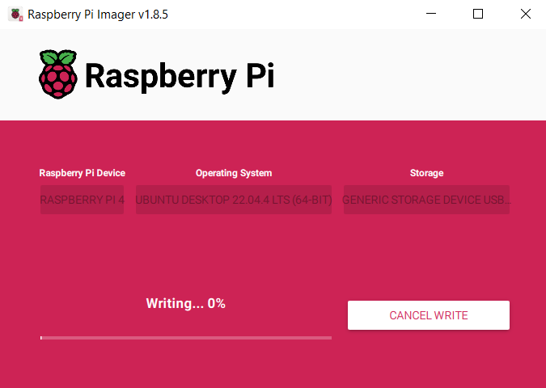

# Raspberry Pi OS 셋팅(Ubuntu 22.04)

## Step1. Window PC에서 Raspberry Pi Imager 실행

(imager 다운 링크 : [Click_here](https://www.raspberrypi.com/software/))

  

## Step2. 기기선택 ⇒ Raspberry pi4를 선택

  

  

## Step3. OS선택

 Other general-purpose OS ⇒ Ubuntu ⇒ Ubuntu DeskTop 22.04(22.04.05도 가능)

  

## Step4. Window PC에 SD카드를 삽입 후, 해당 위치를 선택

  

## Step5. 완료 (Writing 완료 후에 SD카드를 Raspberry Pi에 삽입)

  

---
