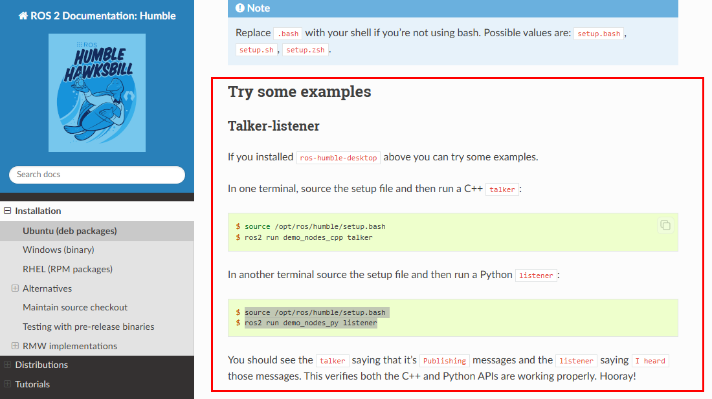
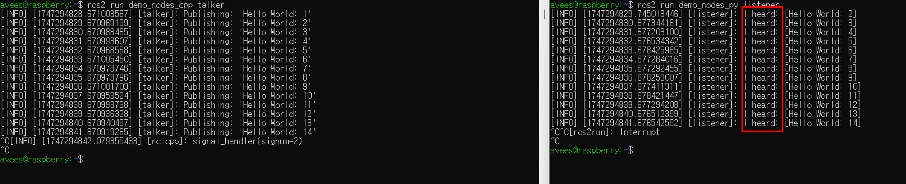
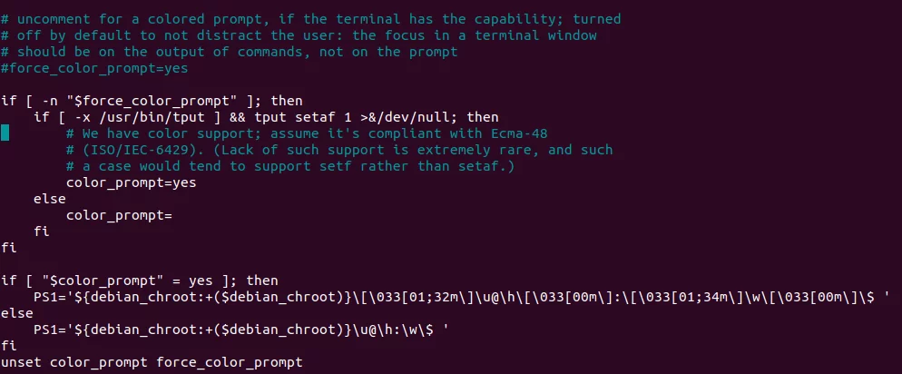

# ROS2-humble 설치

## Step1. ROS2 Humble 설치

[Ubuntu (deb packages) — ROS 2 Documentation: Humble  documentation](https://docs.ros.org/en/humble/Installation/Ubuntu-Install-Debs.html)

> 위 링크에 들어가서 Try Some examples까지 터미널에 입력하여 설치를 진행한다.

  

> 테스트 코드 실행 시, 다음과 같은 화면이 뜨면 설치에 성공한 것이다.

  

## Step2. bash 설정
> 터미널 창을 새로 열때마다 “source /opt/ros/humble/setup.bash” 해줘야함

### 자동으로 설정하기

> “gedit ~/.bashrc” 명령어를 입력하여 bash 진입

  

> 맨 밑에 줄에 “source /opt/ros/humble/setup.bash” 삽입 후 exit

> exit 후에 터미널창에 “source ~/.bashrc”입력(변경사항 저장)
